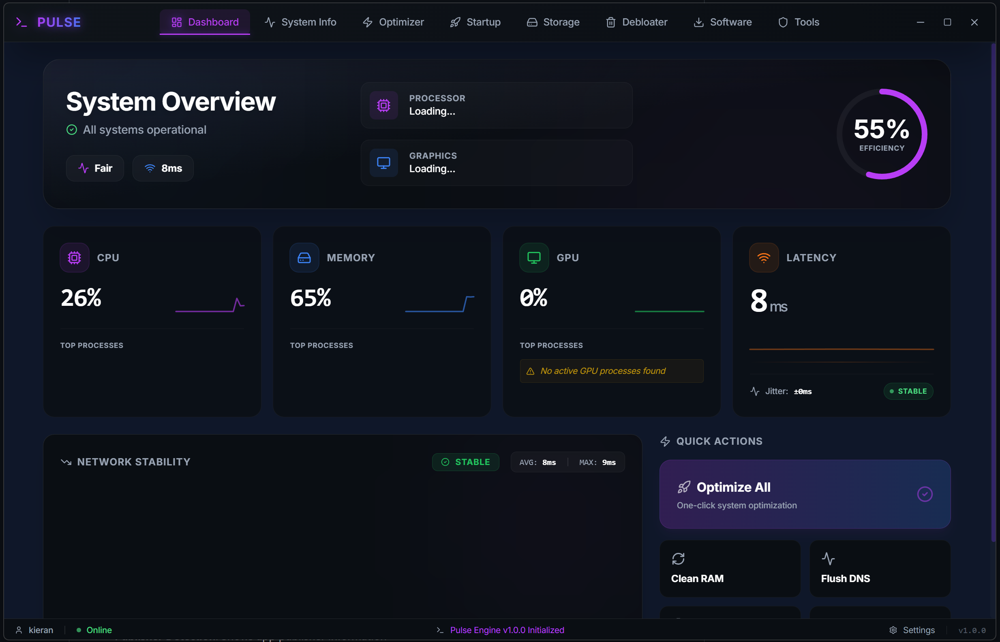
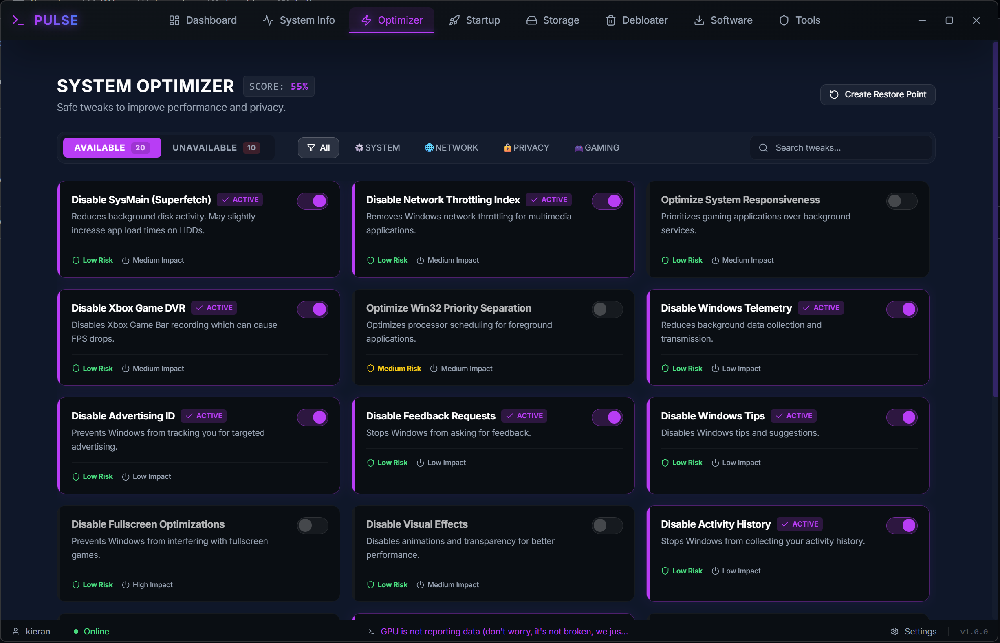
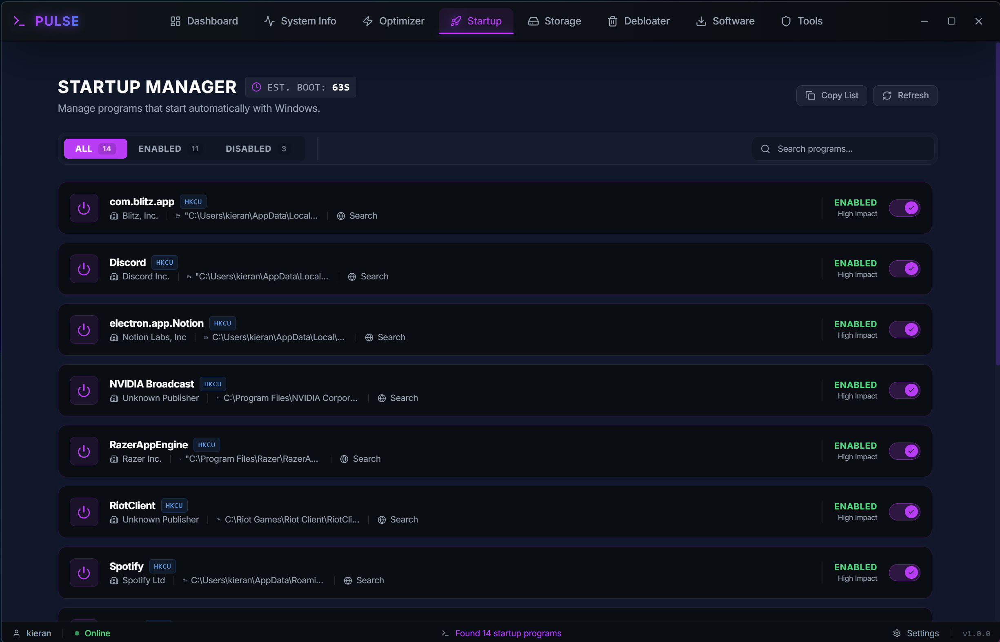
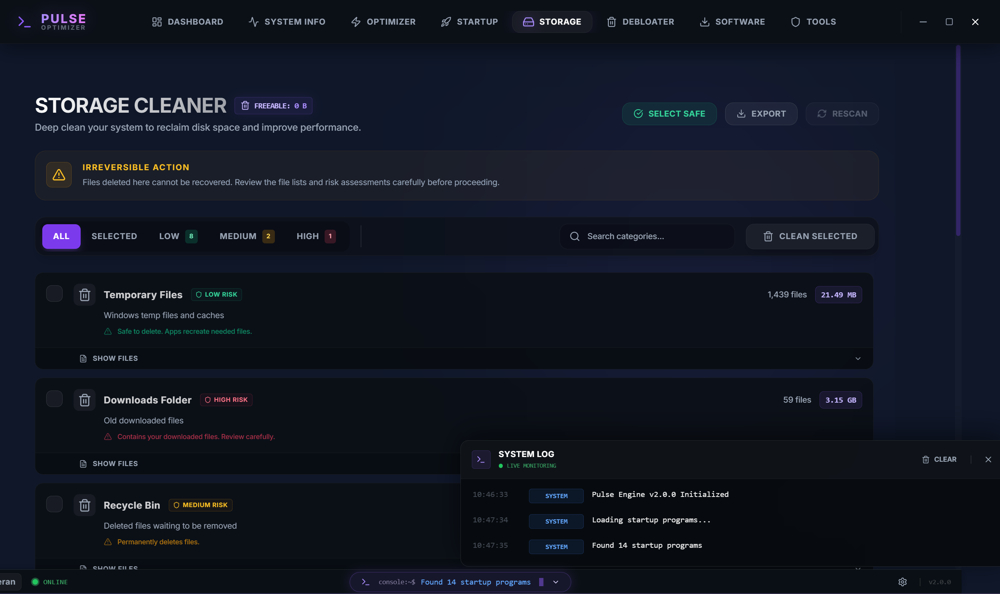

# ⚡ Pulse Optimizer

> A modern, powerful Windows gaming optimization tool built with Electron, React, and TypeScript

[](https://opensource.org/licenses/MIT)
[](https://www.microsoft.com/windows)
[](https://www.electronjs.org/)
[](https://reactjs.org/)

---

## 📸 Screenshots

### Dashboard
<!-- SCREENSHOT: Replace with actual screenshot -->

*Main dashboard showing system overview and quick actions*

### System Optimizer
<!-- SCREENSHOT: Replace with actual screenshot -->

*Comprehensive system optimization with risk assessment*

### Startup Manager
<!-- SCREENSHOT: Replace with actual screenshot -->

*Manage startup programs with search and filtering*

### Storage Cleaner
<!-- SCREENSHOT: Replace with actual screenshot -->

*Clean junk files and reclaim disk space*

---

## ✨ Features

### 🎮 System Optimization
- **Smart Optimizations**: 20+ carefully curated optimizations for gaming performance
- **Risk Assessment**: Color-coded risk levels (Safe, Low, Medium, High)
- **One-Click Apply**: Apply all safe optimizations instantly
- **Revert Capability**: Undo any optimization with a single click
- **Real-time Impact**: See the effects immediately

### 💻 System Information
- **Hardware Details**: CPU, GPU, RAM, Storage information
- **Live Monitoring**: Real-time system stats with auto-refresh
- **Network Info**: Adapter details, speeds, IP addresses
- **Security Status**: TPM, Secure Boot, Antivirus detection
- **Battery Info**: For laptops - charge, health, power plan

### 🚀 Startup Manager
- **Registry Integration**: Manages both registry and startup folder items
- **Publisher Detection**: Shows app publisher information
- **Quick Actions**: Search online, refresh, copy list
- **Filter & Search**: Find apps quickly with advanced filtering
- **Modern UI**: Card-based layout with smooth animations

### 🗑️ Storage Cleaner
- **Multiple Categories**: Temp files, cache, logs, downloads, recycle bin
- **Size Detection**: See exactly how much space you'll reclaim
- **Safe Selection**: "Select Safe" button for worry-free cleaning
- **Risk Indicators**: Know the risk level before cleaning
- **Export Reports**: Save cleaning history

### 🛡️ Windows Debloater
- **Remove Bloatware**: Uninstall pre-installed Windows apps
- **Status Detection**: See what's installed vs not installed
- **Risk Assessment**: Know which apps are safe to remove
- **Bulk Actions**: "Remove All Safe" for quick debloating
- **Export Reports**: Document what you've removed

### 📦 Software Store
- **Curated Apps**: Gaming essentials, development tools, utilities
- **One-Click Install**: Download and install with a single click
- **Category Filters**: Browse by category or installation status
- **Progress Tracking**: Real-time download/install progress
- **Install All Gaming**: Bulk install all gaming-related software

### 🌐 Network Tools
- **DNS Management**: Switch between 15+ DNS providers
- **Speed Comparison**: Built-in DNS comparison table
- **Quick Apply**: One-click apply best DNS (Cloudflare)
- **Hosts File Editor**: Edit Windows hosts file with safety checks
- **Ad Blocklists**: Import popular blocklists
- **Speed Test**: Test your network performance

### ⚙️ Settings
- **Theme Switching**: Light, Dark, and System themes
- **Backup & Restore**: Create and restore system backups
- **Export/Import**: Share settings across machines
- **Backup Management**: View, restore, or delete backups
- **Statistics**: See backup count, size, and last backup date

---

## 🚀 Getting Started

### Prerequisites
- Windows 10/11 (64-bit)
- Node.js 18+ and npm

### Installation

1. **Clone the repository**
   ```bash
   git clone https://github.com/wadforth/pulse-optimizer.git
   cd pulse-optimizer
   ```

2. **Install dependencies**
   ```bash
   npm install
   ```

3. **Run in development mode**
   ```bash
   npm run dev
   ```

4. **Build for production**
   ```bash
   npm run build
   ```

---

## 🛠️ Tech Stack

- **Framework**: Electron 28+
- **Frontend**: React 18 with TypeScript
- **Styling**: Tailwind CSS
- **Animations**: Framer Motion
- **Icons**: Lucide React
- **Build Tool**: Vite
- **Backend**: PowerShell scripts for Windows integration

---

## 📁 Project Structure

```
pulse-optimizer/
├── electron/           # Electron main process
│   ├── main.ts        # Main process entry
│   └── preload.ts     # Preload scripts
├── src/
│   ├── components/    # React components
│   │   ├── Dashboard.tsx
│   │   ├── Optimizer.tsx
│   │   ├── StartupManager.tsx
│   │   ├── StorageCleaner.tsx
│   │   ├── Debloater.tsx
│   │   ├── SoftwareStore.tsx
│   │   ├── Tools.tsx
│   │   ├── SystemInfo.tsx
│   │   └── Settings.tsx
│   ├── context/       # React context providers
│   ├── App.tsx        # Main app component
│   └── main.tsx       # React entry point
├── public/            # Static assets
└── README.md
```

---

## 🎨 Features in Detail

### System Optimization Categories

- **Gaming Performance**: FPS boosts, reduce latency, disable telemetry
- **Network**: Optimize TCP/IP, disable bandwidth throttling
- **Storage**: Disable hibernation, optimize paging file
- **Privacy**: Disable tracking, telemetry, Cortana
- **Visual Effects**: Disable animations for performance
- **Background Tasks**: Disable unnecessary services

### DNS Providers Included

- Cloudflare (1.1.1.1) - Fast & Private
- Google DNS (8.8.8.8) - Reliable
- Quad9 (9.9.9.9) - Security focused
- OpenDNS (208.67.222.222) - Family safe options
- AdGuard DNS - Ad blocking
- And 10+ more...

---

## ⚠️ Important Notes

### Administrator Privileges
Most features require administrator privileges to function properly. The app will prompt for elevation when needed.

### Risk Levels
- 🟢 **Safe**: No known issues, widely recommended
- 🟡 **Low**: Minor impacts, easily reversible
- 🟠 **Medium**: May affect some features
- 🔴 **High**: Significant system changes, use with caution

### Backup & Restore
Always create a system restore point before making significant changes. Use the built-in backup feature to save your optimization state.

---

## 🐛 Known Issues

- Storage cleaner may require multiple scans for accurate file sizes
- Some antivirus software may flag the app (false positive)
- GPU detection may not work for all graphics cards

---

## 🗺️ Roadmap

- [ ] Game-specific optimization profiles
- [ ] Automatic optimization scheduler
- [ ] Performance benchmarking tools
- [ ] One-click system restore points
- [ ] Cloud backup sync
- [ ] Plugin system for custom optimizations
- [ ] Multi-language support

---

## 📝 License

This project is licensed under the MIT License - see the [LICENSE](LICENSE) file for details.

---

## 🤝 Contributing

Contributions are welcome! Please feel free to submit a Pull Request.

1. Fork the repository
2. Create your feature branch (`git checkout -b feature/AmazingFeature`)
3. Commit your changes (`git commit -m 'Add some AmazingFeature'`)
4. Push to the branch (`git push origin feature/AmazingFeature`)
5. Open a Pull Request

---

## 📧 Contact

Kieran Wadforth - [@wadforth](https://github.com/wadforth)

Project Link: [https://github.com/wadforth/pulse-optimizer](https://github.com/wadforth/pulse-optimizer)

---

## 🙏 Acknowledgments

- [Electron](https://www.electronjs.org/) - Cross-platform desktop apps
- [React](https://reactjs.org/) - UI framework
- [Tailwind CSS](https://tailwindcss.com/) - Styling
- [Framer Motion](https://www.framer.com/motion/) - Animations
- [Lucide](https://lucide.dev/) - Beautiful icons

---

<div align="center">
  <sub>Built with ❤️ by Kieran Wadforth</sub>
</div>
